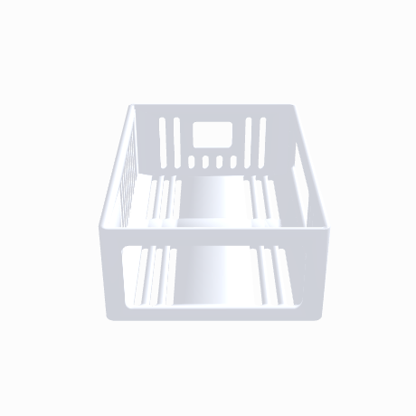

  

# OpenHome Dev Kit — Raspberry Pi Top Shroud

A cover for the exposed Pi 4 + OpenHome HAT stack that sits on top of the printed
speaker enclosure. Open bottom, drops straight over the stack, rests on the
enclosure's top face. Nothing about the existing enclosure changes.

  

## 🧊 Interactive 3D

The model is up on GitHub's built-in 3D viewer — open it and drag it around:

> 👉 [**Open the 3D model** — `OpenHome_Pi_Case.stl`](OpenHome_Pi_Case.stl)

> 🎨 **View of the debossed brand** — `PRECIADO TECH`:
>  

## Files

| File | What it is |
|---|---|
| [`OpenHome_Pi_Case.stl`](OpenHome_Pi_Case.stl) | Ready to slice. **"PRECIADO TECH"** debossed on top. |
| [`assets/`](assets/) | Renders: banner, rotating 3D previews, static views. |

## Size

- Outside: **96.8 × 66.8 × 32.4 mm**
- Interior cavity: 92 × 62 × 30 mm
- Walls 2.4 mm, top 2.4 mm, 3 mm corner radius
- ~26 cm³ of plastic → roughly **30–35 g** at normal wall/infill settings

The enclosure's top face is 100 × 95 mm, so this sits inside that footprint with
a small margin all the way around.

## What's on it

- **Ethernet + 4× USB-A** — one large 54 × 23.5 mm window on the short end
- **USB-C power, 2× micro-HDMI, 3.5 mm jack** — 58 × 19 mm window on the long side
- **microSD** — 16 × 12 mm slot on the opposite short end
- **Wire exit notch** — 15 mm notch at the top of the back long side for the
  speaker/GPIO leads
- **Side grills** — vertical slots on three sides, bottom 5 mm left solid so the
  rim stays stiff
- **Top grill** — six rows of slots either side of the name

(No standoff pass-through holes — the standoffs stay under the lid. The parametric
source has a `STANDOFF_HOLES` flag if you ever want them back.)

The big side window and the top slots give a straight convection path — cool air
in low through the grills, hot air out the top.

## Printing

**Print it upside down — top face flat on the plate.** The STL is already
oriented that way, so just drop it in and slice.

- No supports needed anywhere
- 0.2 mm layers, 3 walls, 15% infill
- The debossed name prints against the build plate, so it comes out crisp

If you want the text in a second color, add a filament change at ~0.6 mm.

## Changing the name

The name is set in the parametric source (`.scad`), which auto-shrinks to fit, so
longer names still work. Or use a blank variant and add text with the slicer's
text tool.

## Before you print — two numbers worth checking

Built from an approximate 90 × 60 × 27 mm stack plus margin. Measure your actual
stack from the enclosure's top face:

- `STACK_H` — top face to the tallest thing on the stack.
  If the lid bottoms out before it seats, raise this.
- `STACK_L` / `STACK_W` — the footprint including how far the USB and Ethernet
  jacks hang past the board edge.

Everything else keys off those three numbers, so a re-export takes seconds.
Also worth a dry check: the port windows are deliberately tall so the exact
height of the Pi above the face doesn't have to be exact — but confirm the
USB-C plug clears the bottom edge of its window.

## License

[MIT](LICENSE) © Preciado Tech.
