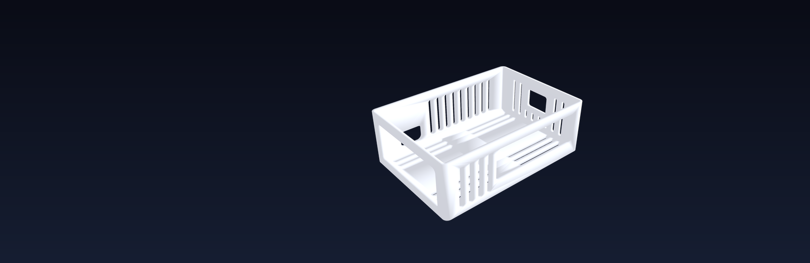
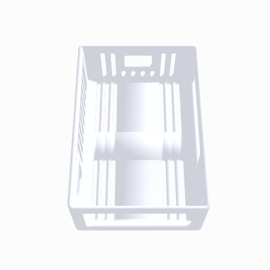

  

## 🧊 Interactive 3D

The model is live in GitHub's built-in 3D viewer — click through and drag it around:

> 👉 [**Open the 3D model** — `OpenHome_Pi_Case.stl`](OpenHome_Pi_Case.stl)

> 🎨 **Debossed brand** — `PRECIADO TECH` on top:
>  

## Size

- Outside: **96.8 × 66.8 × 32.4 mm**
- Interior cavity: 92 × 62 × 30 mm
- Walls 2.4 mm, top 2.4 mm, 3 mm corner radius
- ~26 cm³ of plastic → roughly **30–35 g** at normal wall/infill settings

The enclosure's top face is 100 × 95 mm, so this sits inside that footprint with
a small margin all the way around.

## What's on it

- **Ethernet + 4× USB-A** — one large 54 × 23.5 mm window on the short end
- **USB-C power, 2× micro-HDMI, 3.5 mm jack** — 58 × 19 mm window on the long side
- **Wire exit notch** — 15 mm notch at the top of the back long side for the
  speaker/GPIO leads
- **Side grills** — vertical slots on three sides, bottom 5 mm left solid so the
  rim stays stiff
- **Top grill** — six rows of slots either side of the name

The big side window and the top slots give a straight convection path — cool air
in low through the grills, hot air out the top.

## Printing

**Print it upside down — top face flat on the plate.** The STL is already
oriented that way, so just drop it in and slice.

- 0.2 mm layers, 3 walls, 15% infill
- The debossed name prints against the build plate, so it comes out crisp

If you want the text in a second color, add a filament change at ~0.6 mm.
